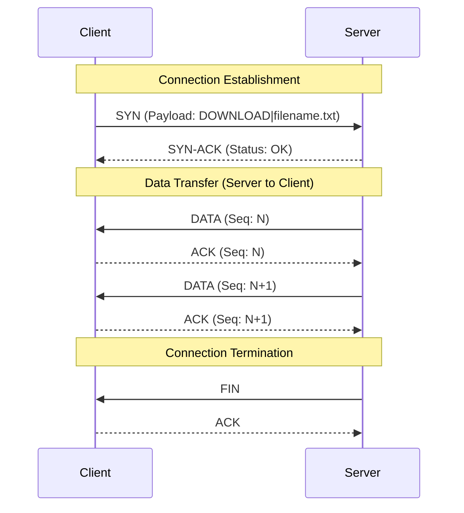
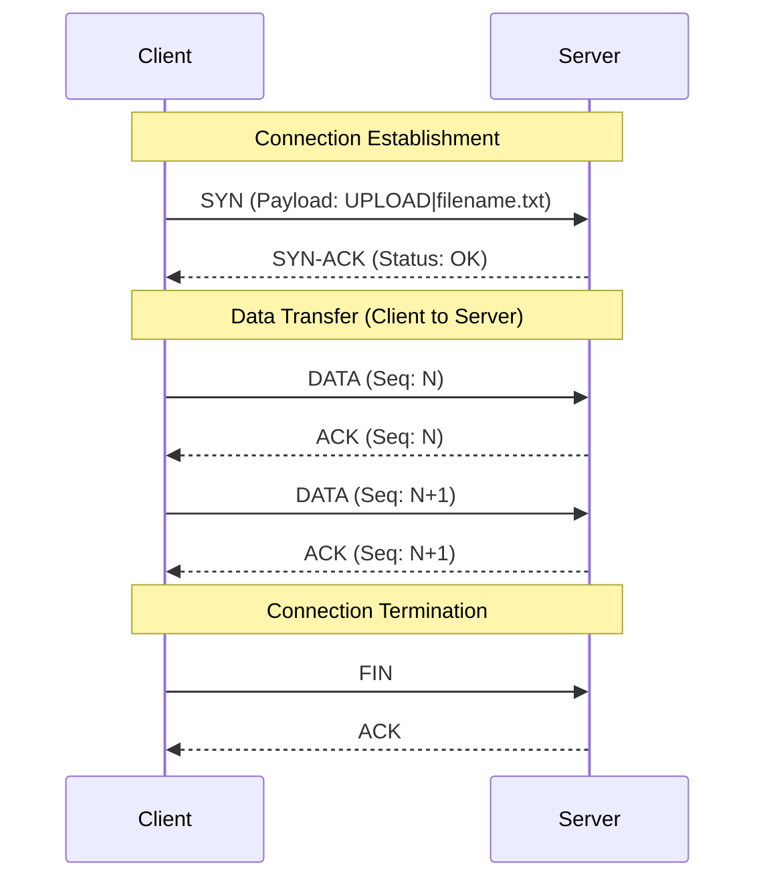

# Reliable Data Transfer over UDP (RDT-UDP) Mini RFC

## 1. Introduction
This document specifies the RDT-UDP (Reliable Data Transfer over UDP) protocol. RDT-UDP is a custom application-layer protocol designed to provide TCP-like features over the connectionless UDP transport protocol. It MUST ensure reliable, ordered data delivery, session management, and robust error handling. 

The protocol utilizes a Stop-and-Wait ARQ (Automatic Repeat reQuest) mechanism to guarantee that no data packets are lost or delivered out of order. Each packet MUST include a sequence number and REQUIRES an explicit acknowledgment (ACK) from the receiver before the sender transmits the subsequent packet.

## 2. Protocol Overview

The protocol establishes a session before data transfer, performs the transfer (upload or download), and then gracefully terminates the connection.

### 2.1 Message Exchanges (Swimlane Diagrams)

**Flow 1: Successful Download (Client requests a file from Server)**

**Flow 2: Successful Upload (Client sends a file to Server)**

## 3. Packet Message Formats

RDT-UDP MUST use a fixed 12-byte header for all messages, followed by a variable-length payload.

### 3.1 Header Structure

| Offset (Bytes) | Field Name | Size | Description |
| :--- | :--- | :--- | :--- |
| `0` | **Type** | 1 byte | Indicates the message type. |
| `1` | **Sequence Number** | 4 bytes | 32-bit unsigned integer identifying the packet order. |
| `5` | **Session ID** | 4 bytes | 32-bit unsigned integer uniquely identifying the session. |
| `9` | **Payload Length** | 2 bytes | 16-bit unsigned integer indicating the size of the payload. |
| `11` | **Checksum** | 1 byte | Simple XOR checksum of the header and payload bytes. |

*Note: All multi-byte integers MUST be transmitted in Network Byte Order (Big-Endian).*

### 3.2 Message Types (`Type` Field)

*   `0 (SYN)`: Connection initialization request. Payload contains the operation and filename (e.g., `DOWNLOAD|file.txt`).
*   `1 (SYN-ACK)`: Acknowledgment of initialization and parameter agreement.
*   `2 (DATA)`: Carries the actual file data chunk in the payload.
*   `3 (ACK)`: Acknowledges successful receipt of a packet.
*   `4 (FIN)`: Indicates no more data to send; initiates connection termination.
*   `5 (FIN-ACK)`: Acknowledges the termination request. *(In this implementation, `ACK` is reused for FIN acknowledgment).*
*   `6 (ERROR)`: Indicates an error occurred (e.g., File Not Found). Payload contains the error description string.

## 4. State Machines (Transition Diagram)

### 4.1 Client State Machine

*   **CLOSED**: The initial and final state.
*   **SYN_SENT**: The client has sent a `SYN` packet and is waiting for a `SYN-ACK`.
*   **TRANSFERRING**: 
    *   *(Download)* Waiting for `DATA` from server, sending `ACK` in return.
    *   *(Upload)* Sending `DATA` to server, waiting for `ACK`.
*   **FIN_WAIT**: The client has sent a `FIN` and is waiting for the server's `ACK`.

### 4.2 Server State Machine

*   **LISTEN**: Waiting for an incoming `SYN` from any client.
*   **TRANSFERRING**:
    *   *(Download)* Sending `DATA` to client, waiting for `ACK`. If timeout expires, retransmit.
    *   *(Upload)* Waiting for `DATA` from client, sending `ACK` for expected sequence numbers.
*   **FIN_WAIT**: Server has sent a `FIN` and is waiting for the final `ACK` from the client.

## 5. Reliability Mechanisms

### 5.1 Sequencing and Ordered Delivery
Every packet MUST contain a 32-bit Sequence Number. 
*   In the Stop-and-Wait protocol, the sender MUST NOT transmit `Seq N+1` until it receives an acknowledgment for `Seq N`.
*   The receiver MUST track the `Expected Sequence Number`. If an out-of-order packet arrives (e.g., expected 5, received 6), or an old duplicate arrives, it MUST respond with an ACK for the last successfully received packet to trigger resynchronization. This ensures the binary file is written sequentially to disk.

### 5.2 Error Detection (Checksum)
A 1-byte XOR checksum MUST be calculated over both the header and the payload before transmission. Upon receiving a packet, the recipient MUST recalculate the checksum. If the calculated checksum does not match the received checksum, the packet MUST be assumed corrupted and SHOULD be silently dropped (which will trigger a timeout and retransmission from the sender).

### 5.3 Timeout and Retransmission
The sender MUST start a timer when a `DATA`, `SYN`, or `FIN` packet is transmitted. If an `ACK` for that specific Sequence Number is not received within the `TIMEOUT` threshold (default: 2.0 seconds), the sender MUST retransmit the exact packet. This continues until an acknowledgment is received or a predefined maximum retry limit (if implemented) is reached.

## 6. Error Handling

*   **File Not Found:** If a Client requests a download for a file that does not exist on the Server, the Server MUST reply with an `ERROR` packet (Type 6) with the payload "File not found" and MAY drop the session. The Client SHOULD display this error and terminate cleanly.
*   **Session Mismatch:** The Server MUST handle concurrent sessions using the 32-bit `Session ID`. If a packet arrives with an unrecognized `Session ID`, it MUST be ignored. This prevents crossover between different users communicating with the same Server port.
*   **Client Crash / Unresponsive:** If a Client abruptly disconnects during a download, the Server's timeouts will trigger retransmissions. To prevent infinite loops and memory leaks, the Server SHOULD implement a stale session cleanup mechanism that drops any session inactive for more than `TIMEOUT * 5` seconds.

## 7. End-of-File Signaling and Protocol Termination

When the sender (Client during Upload, Server during Download) reads the end of the file from the local disk:
1.  It MUST generate a `FIN` packet.
2.  It MUST send the `FIN` packet and start its retransmission timer.
3.  The receiver, upon getting the `FIN`, MUST close its local file pointer to flush the data to disk, and MUST reply with an `ACK`.
4.  Upon receiving the `ACK` for the `FIN`, the sender MUST close the session and release resources.
