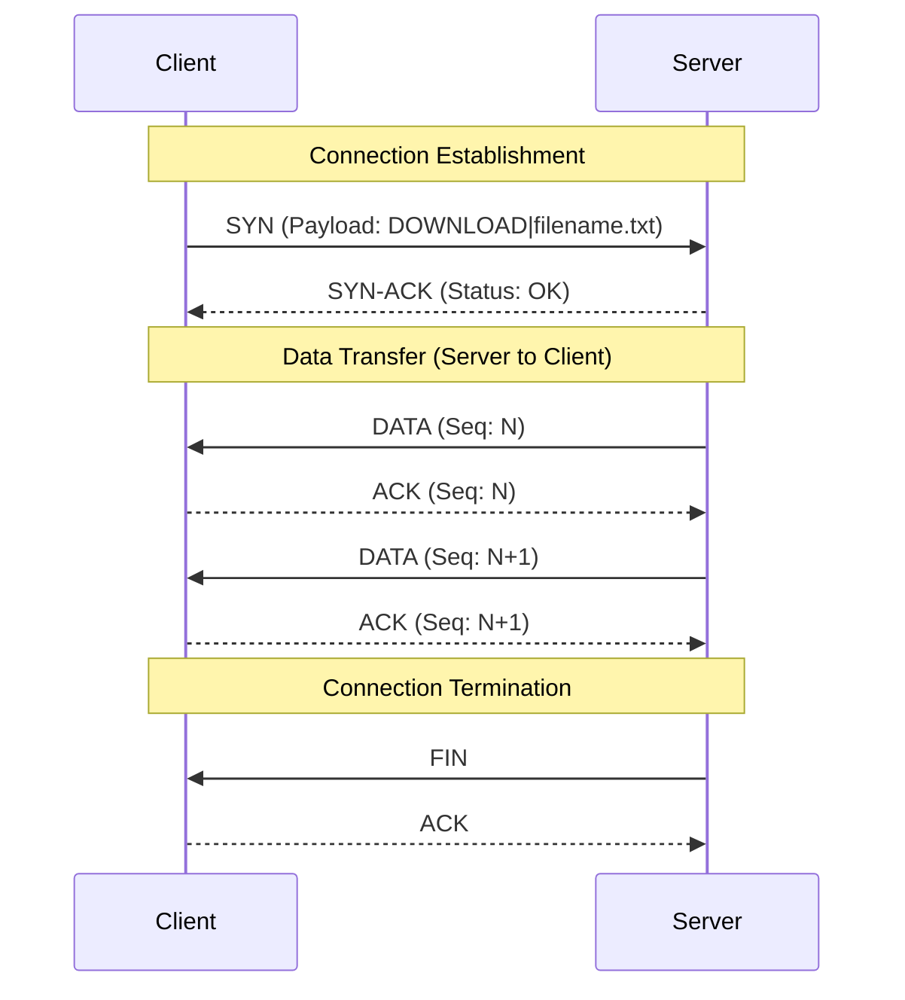
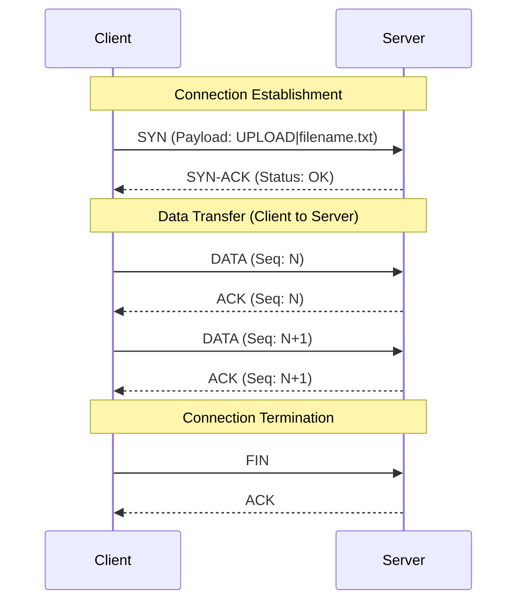

# Reliable Data Transfer over UDP (RDT-UDP) Mini RFC

## 1. Introduction
This document specifies the RDT-UDP (Reliable Data Transfer over UDP) protocol. It provides TCP-like connection management, ordered delivery, and error handling over UDP.

The protocol MUST use a Stop-and-Wait ARQ. Each packet MUST contain a sequence number and REQUIRES an explicit acknowledgment (ACK) before the sender transmits the next packet.

## 2. Protocol Overview
RDT-UDP establishes a session via a 3-way handshake, transfers data strictly sequentially, and gracefully terminates the session via FIN exchanges.

### 2.1 Message Exchanges

**Flow 2: Successful Upload (Client sends a file to Server)**

## 3. Packet Message Formats

RDT-UDP MUST use a fixed 12-byte header for all messages, followed by a variable-length payload.

### 3.1 Header Structure

| Offset (Bytes) | Field Name | Size | Description |
| :--- | :--- | :--- | :--- |
| `0` | **Type** | 1 byte | Indicates the message type. |
| `1` | **Sequence Number** | 4 bytes | 32-bit unsigned integer identifying the packet order. |
| `5` | **Session ID** | 4 bytes | 32-bit unsigned integer uniquely identifying the session. |
| `9` | **Payload Length** | 2 bytes | 16-bit unsigned integer indicating the size of the payload. |
| `11` | **Checksum** | 1 byte | Simple XOR checksum of the header and payload bytes. |

*Note: All multi-byte integers MUST be transmitted in Network Byte Order (Big-Endian).*

### 3.2 Message Types (`Type` Field)

*   `0 (SYN)`: Connection initialization request. Payload contains the operation and filename (e.g., `DOWNLOAD|file.txt`).
*   `1 (SYN-ACK)`: Acknowledgment of initialization and parameter agreement.
*   `2 (DATA)`: Carries the actual file data chunk in the payload.
*   `3 (ACK)`: Acknowledges successful receipt of a packet.
*   `4 (FIN)`: Indicates no more data to send; initiates connection termination.
*   `5 (FIN-ACK)`: Acknowledges the termination request. *(In this implementation, `ACK` is reused for FIN acknowledgment).*
*   `6 (ERROR)`: Indicates an error occurred (e.g., File Not Found). Payload contains the error description string.

## 4. State Machines

### 4.1 Client
*   **CLOSED**: Initial/final state.
*   **SYN_SENT**: Waiting for `SYN-ACK`.
*   **TRANSFERRING**: Exchanging `DATA`/`ACK`.
*   **FIN_WAIT**: Waiting for final `ACK`.

### 4.2 Server
*   **LISTEN**: Waiting for incoming `SYN`.
*   **TRANSFERRING**: Exchanging `DATA`/`ACK`. Retransmits on timeout.
*   **FIN_WAIT**: Waiting for final `ACK` from client.

## 5. Reliability Mechanisms

### 5.1 Sequencing and Ordered Delivery
Every packet MUST contain a 32-bit Sequence Number. The sender MUST NOT transmit `Seq N+1` until it receives an ACK for `Seq N`. The receiver MUST track the `Expected Sequence Number`. If an out-of-order packet arrives, it MUST respond with an ACK for the last successfully received packet.

### 5.2 Error Detection (Checksum)
A 1-byte XOR checksum MUST be calculated over both the header and the payload. The recipient MUST recalculate and verify the checksum. If mismatched, the packet is assumed corrupted and SHOULD be silently dropped.

### 5.3 Timeout and Retransmission
The sender MUST start a timer when a `DATA`, `SYN`, or `FIN` packet is transmitted. If an `ACK` is not received within `TIMEOUT` (default: 2.0s), the sender MUST retransmit the exact packet.

## 6. Error Handling

*   **File Not Found:** The Server MUST reply with an `ERROR` packet (Type 6) if the requested file doesn't exist.
*   **Session Mismatch:** Unrecognized `Session ID` packets MUST be ignored to prevent crossover.
*   **Unresponsive Peers:** The Server SHOULD implement a stale session cleanup (drop inactive sessions after `TIMEOUT * 5` seconds).

## 7. Protocol Termination

When a sender reads EOF:
1.  It MUST send a `FIN` packet and start its timer.
2.  The receiver MUST flush data to disk and reply with an `ACK`.
3.  Upon receiving the `ACK`, the sender MUST close the session.
